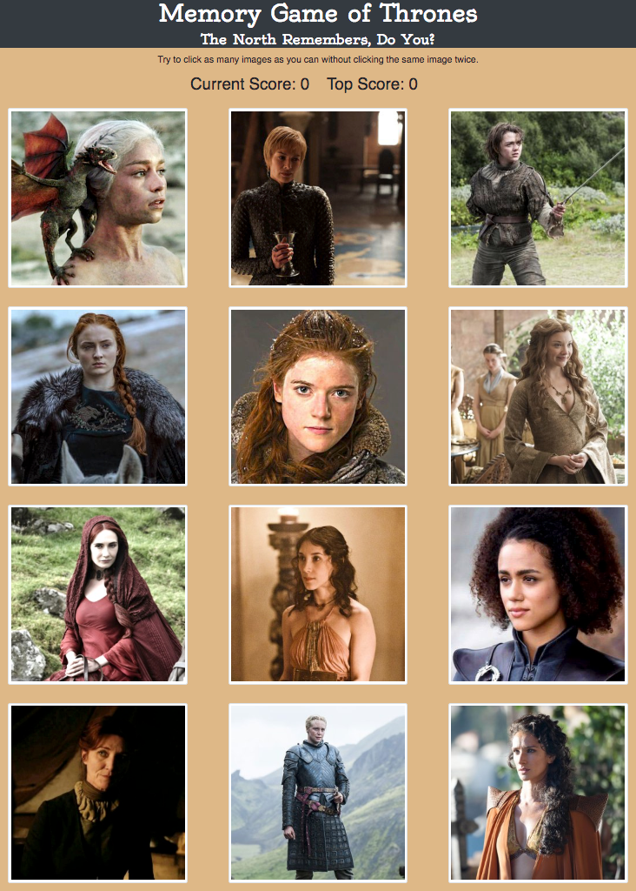

# Memory Game of Thrones

## A React Application

A memory game created with React. This application's user interface is broken up into components. These components are managed with component state and respond to user events.

### Instructions for Play

* The application renders different images female "Game of Thrones" characters to the screen. Each image listens for click events.

* The application keeps track of the user's score. The user's score is incremented when clicking an image for the first time. The user's score is reset to 0 if they click the same image more than once.

* Every time an image is clicked, the images on the page shuffle themselves in a random order.

* Once the user's score is reset after an incorrect guess, the game restarts.

* Top score is tracked until the page is refreshed.

### Link to App on Heroku

[Memory Game of Thrones](https://memory-game-got.herokuapp.com/)

